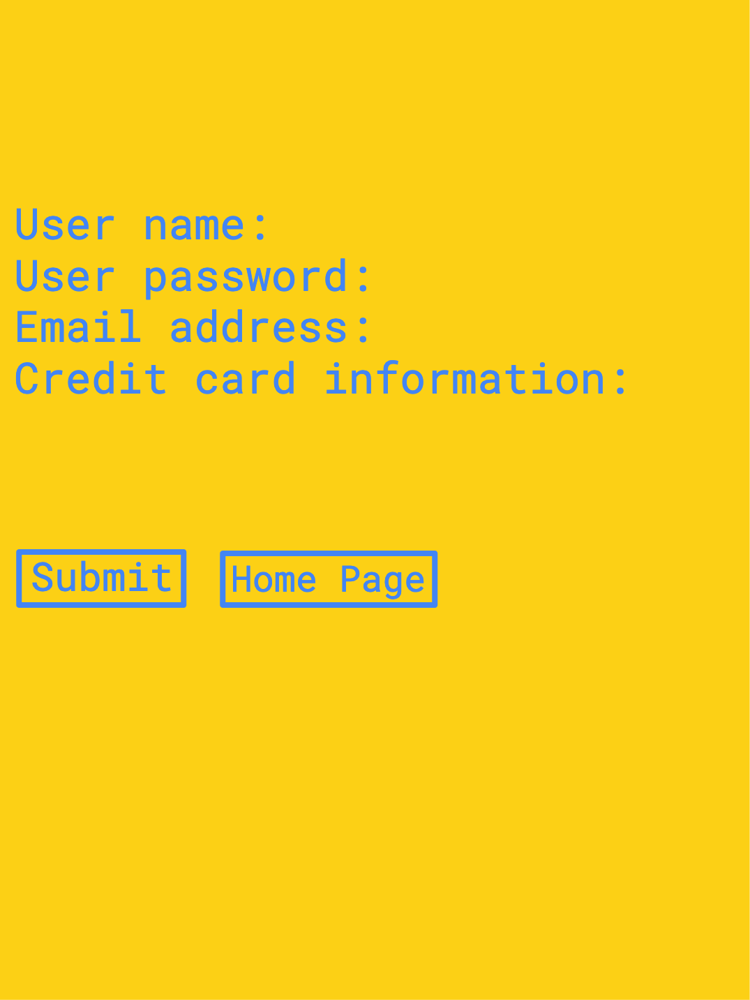

<h1>RightAway</h1>
<h2>Welcome to "Rightaway" app.</h2>
<h3>Choose your service, let us make it ready for you!</h3>

<h2>User Stories</h2>

I created an app called "Rightaway" and it's an app for the people that who are looking for different services as they need. On one of the section called "Groceries" which user can make a list of the groceries that needed and "Rightaway" app would find a local grocery store and make it ready for the delivery to the users. 

<h2>Some Demonstrations About the App</h2>

<h2>Technologies Used</h2>
<ul>
<li>HTML</li>
<li>CSS</li>
<li>Python</li>
<li>Django</li>
<li>PostgreSQL</li>
</ul>

<h2>WireFrame</h2>

